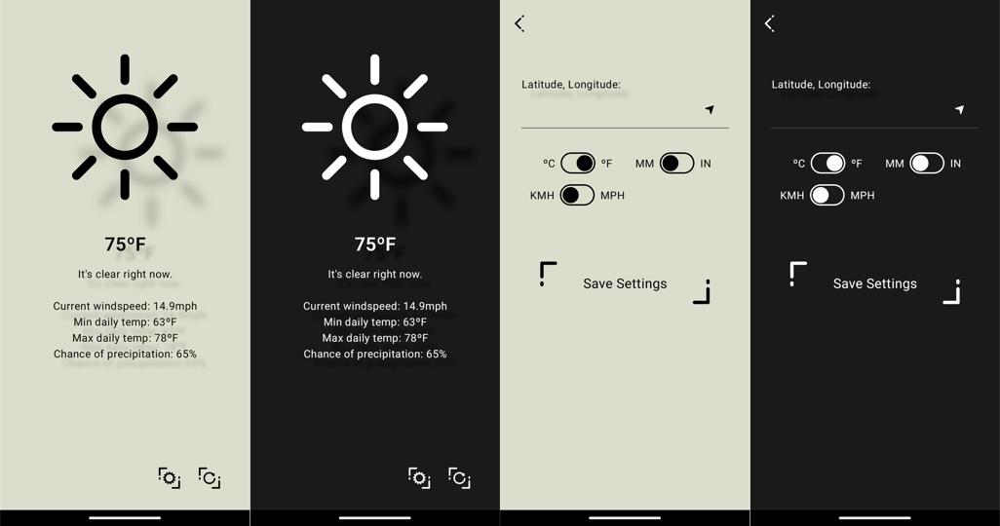

# Funshine

A no-nonsense weather app, for data at a glance.

Creative theme makes informative elements pop off screen, while controls sit on the glass. The inspiration for the theme was wanting something that felt futuristic, but without unnecessary frills. Design philosophy is that data and info is sort of "floating" above a pane of glass, which we show with shadows below them. However, controls are embeded in the glass, and don't have shadows. You can see an example of that in the main weather page below. 

Makes use of the [FunShine design library here](https://github.com/danigol/FunShineDesignLibrary/).

